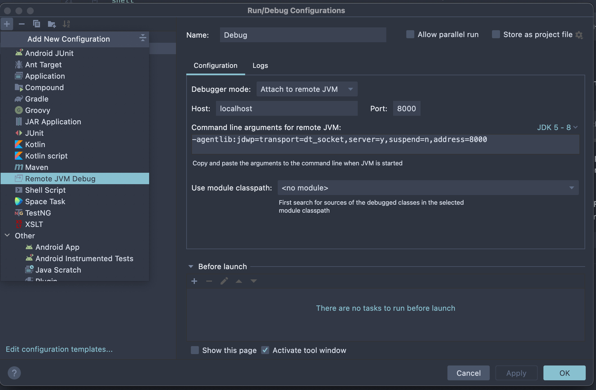
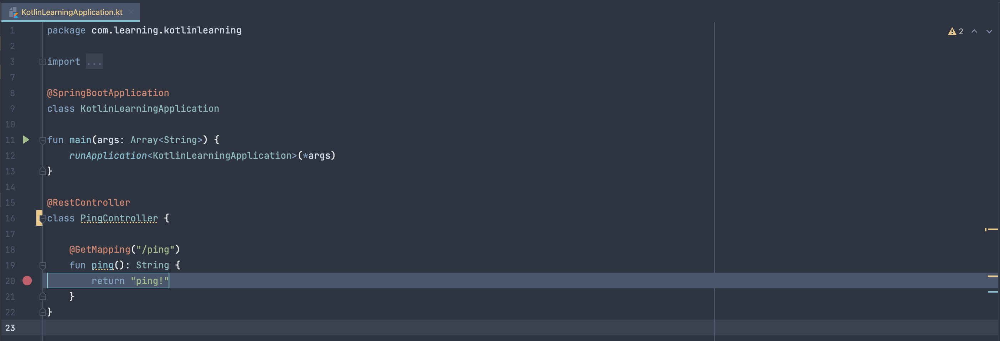

# Kotlin Learning

### Prerequisites:
- JDK 11
- JAVA_HOME set correctly

### Build
If jdk is set correclty you can run gradle build command inside the project main dir like this: 
```shell
./gradlew build
```

### Run
If the .jar file is created (you can check this in build directory) to start the project you can run:
```shell
java -jar build/libs/kotlin-examples-0.0.1-SNAPSHOT.jar
```

### Remote Debug
In order to remote debug you need to add one more Java option to the running command which is:
```shell
java -agentlib:jdwp=transport=dt_socket,server=y,suspend=n,address=127.0.0.1:8000 -jar build/libs/kotlin-examples-0.0.1-SNAPSHOT.jar
```
As you can see I've open the remote debug port 8000 using -agentlib option, please keep in mind that the parameters order maters here.
Next we will connect to this debug port using Intellij Community.<br>

Before connecting we will need to open the **Remote Debug extension** from Intellij and configure it as you will see in the following image.



Here you can see the entire config, after that you can set a break point in to **TestRemoteDebugController ping method**.<br>

After running in debug mode you can trigger in the browser http://localhost:8080/ping link, and you will see the breakpoint stop.




